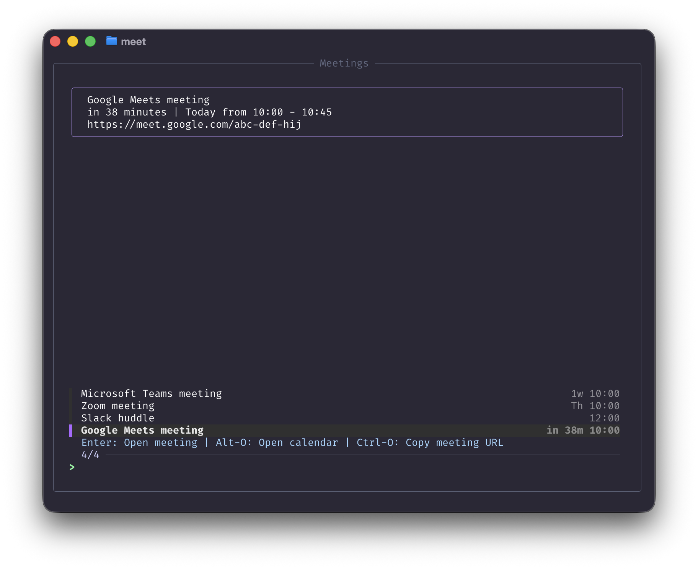

# Meetings

A CLI tool to use fzf to show and join google calendar meetings

# Supports

- Google Meets
- Microsoft Teams
- Zoom Meetings
- Slack Huddles

# Setup

- setup your google calendar api access via this [guide](https://developers.google.com/workspace/calendar/api/quickstart/python#set-up-environment)
- save your generated `credentials.json` to this folder
- `make install` to create alfred symlink
- `pip3 install -r requirements.txt` to install python requirements
- run `python3 meetings.py --register USERNAME` to login a user (supports multiple users via /tokens dir)

# How it works

- `meetings.json` stores a cache of the most recent fetched events
- `meetings-fzf.sh` displays that cache via `format-meetings.jq`
- after the initial load `meetings-fzf.sh` calls `reload-meetings.sh` to rebuild the cache and rerender fzf
